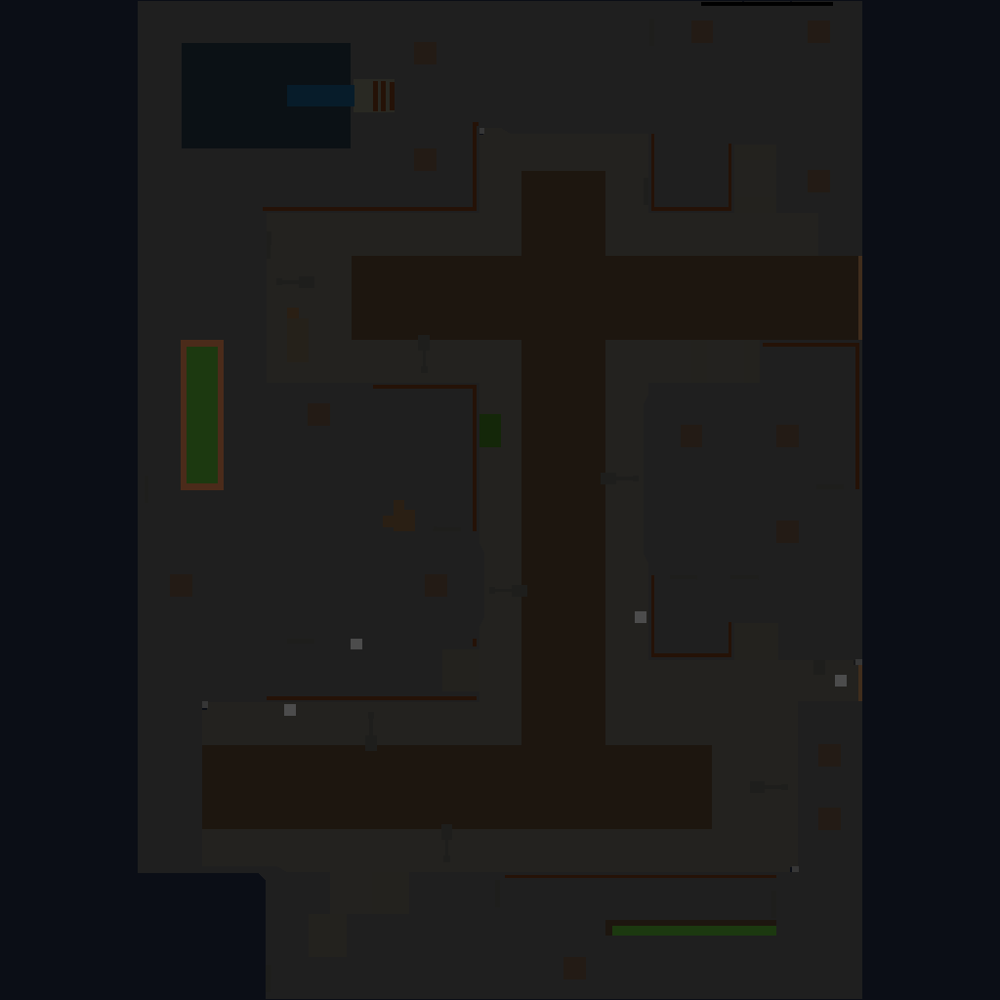
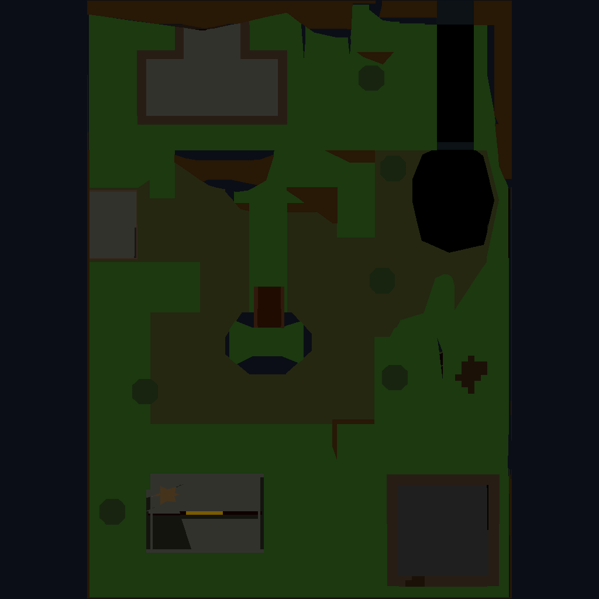
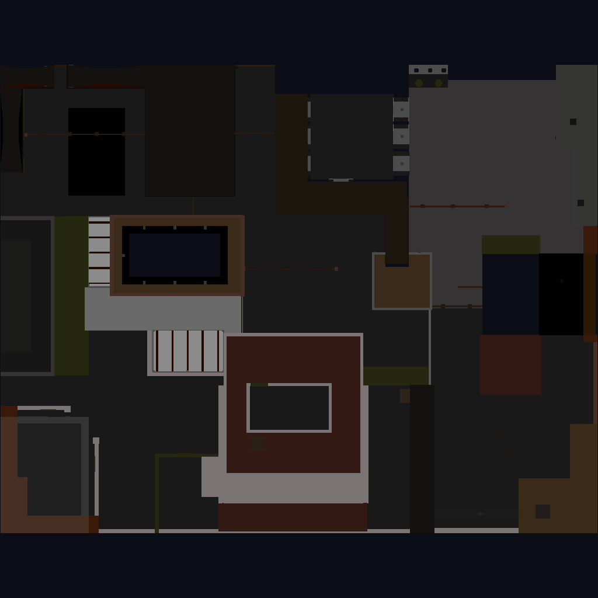
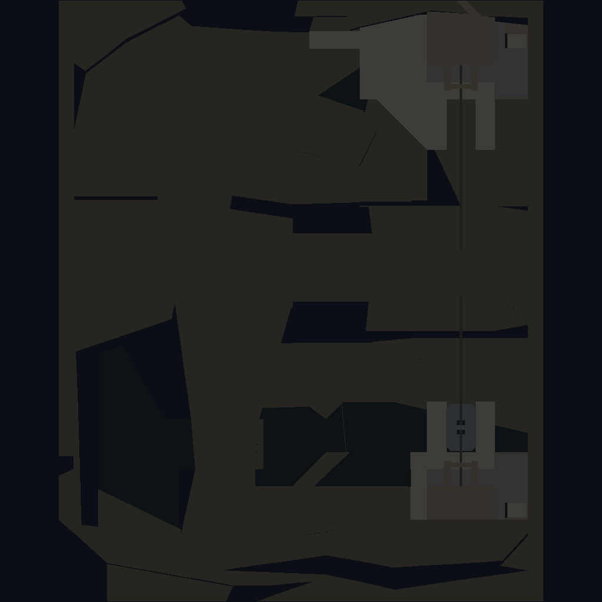

# AQ2 Replay Viewer

A local web application that parses **Action Quake 2** demo files (`.mvd2` / `.mvd2.gz`) and BSP map files to produce an interactive map replay viewer with per-match statistics.

Supports subdirectory scanning for large demo libraries.

---

## Features

- Interactive frame-by-frame replay with 60 fps smooth interpolation
- Top-view textured map overlay (rendered from BSP geometry)
- Per-player stats: kills, deaths, accuracy, damage, headshot kills, awards
- Team scores and round win tracking
- Kill feed, match highlights, weapon usage and hit location charts
- Folder browser with search and pagination — handles 10k+ demo files
- Transparent `.mvd2.gz` decompression (truncated archives yield partial data)

## Map Previews

| icity | wfall | cloud |
|:---:|:---:|:---:|
|  |  |  |

| plaza | oyea | cliff2 |
|:---:|:---:|:---:|
|  |  |  |

---

## Quick Start

### Docker Compose

```bash
docker compose up --build
```

Open **http://localhost:5000** in your browser.

Demo files in `mvd2/` and map assets in `bsp/` are bind-mounted — no rebuild needed when adding new files.

### Local (Python venv)

```bash
python -m venv venv
pip install -r requirements.txt
python web/app.py
```

---

## Folder Structure

```
mvd2/          ← place .mvd2 or .mvd2.gz demo files here (subdirs supported)
bsp/           ← place .bsp map files here
textures/      ← WAD/PAK textures for topview rendering (optional)
colormap.pcx   ← Quake 2 palette
cache/         ← auto-generated topview PNGs (created at runtime)
web/           ← Flask application
```

## Stack

Python 3 / Flask · Pillow · Vanilla JS · CSS custom properties (dark theme)
