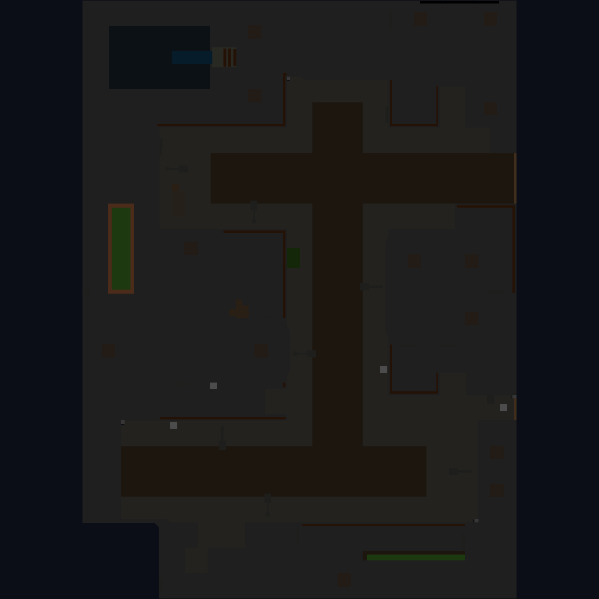
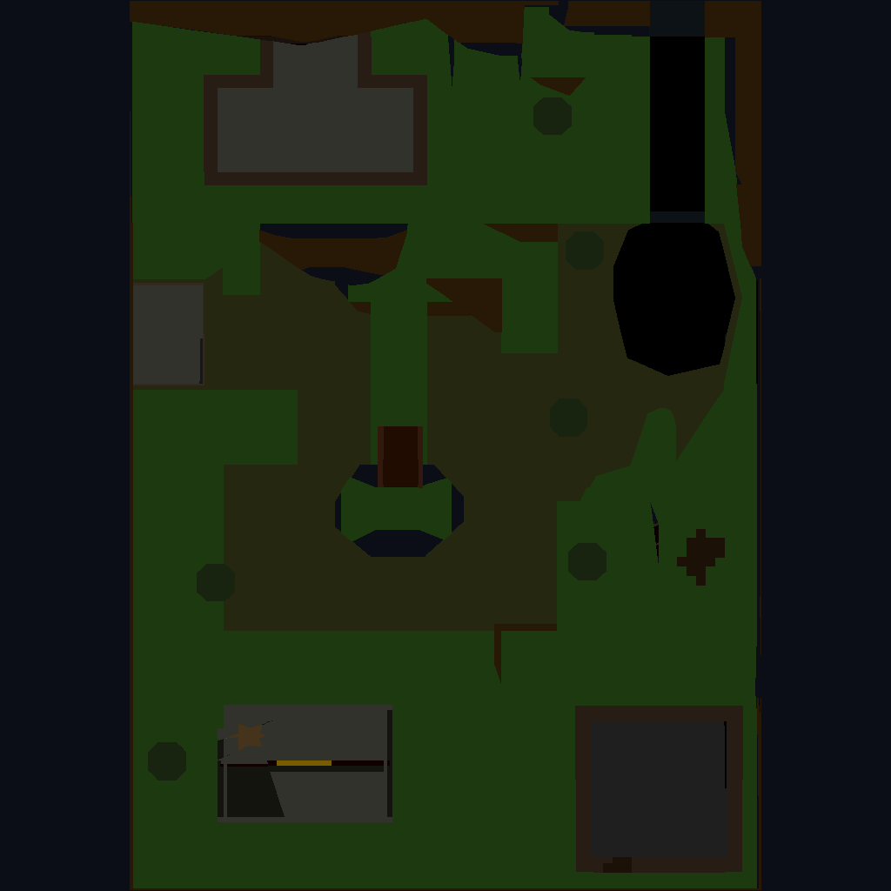
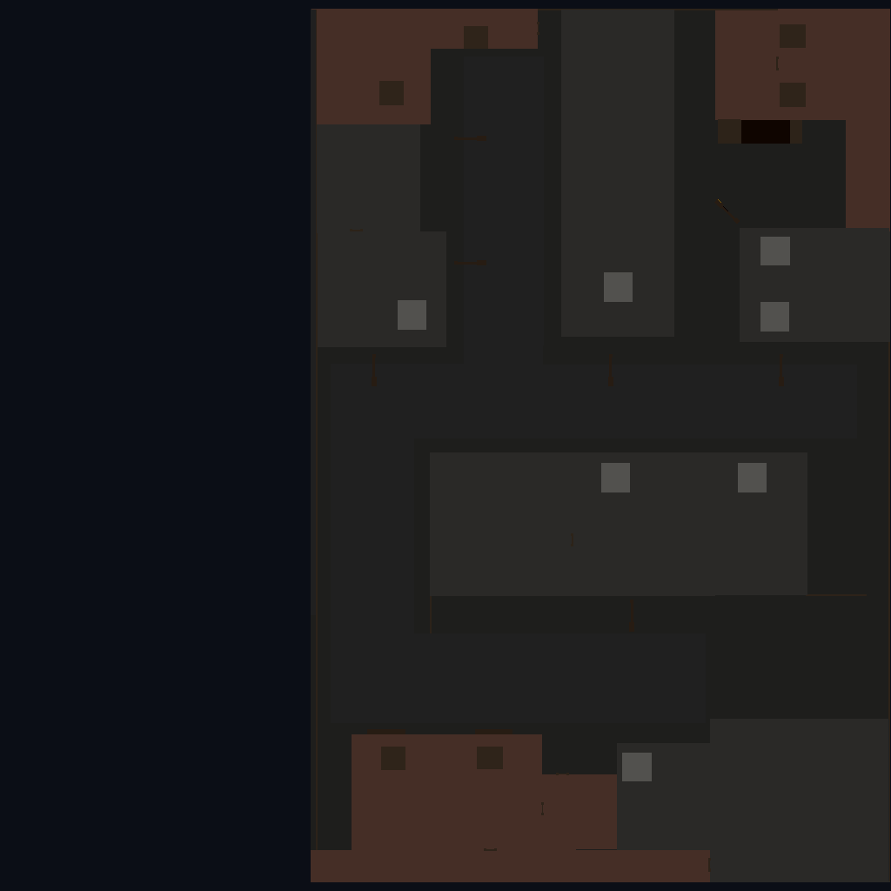
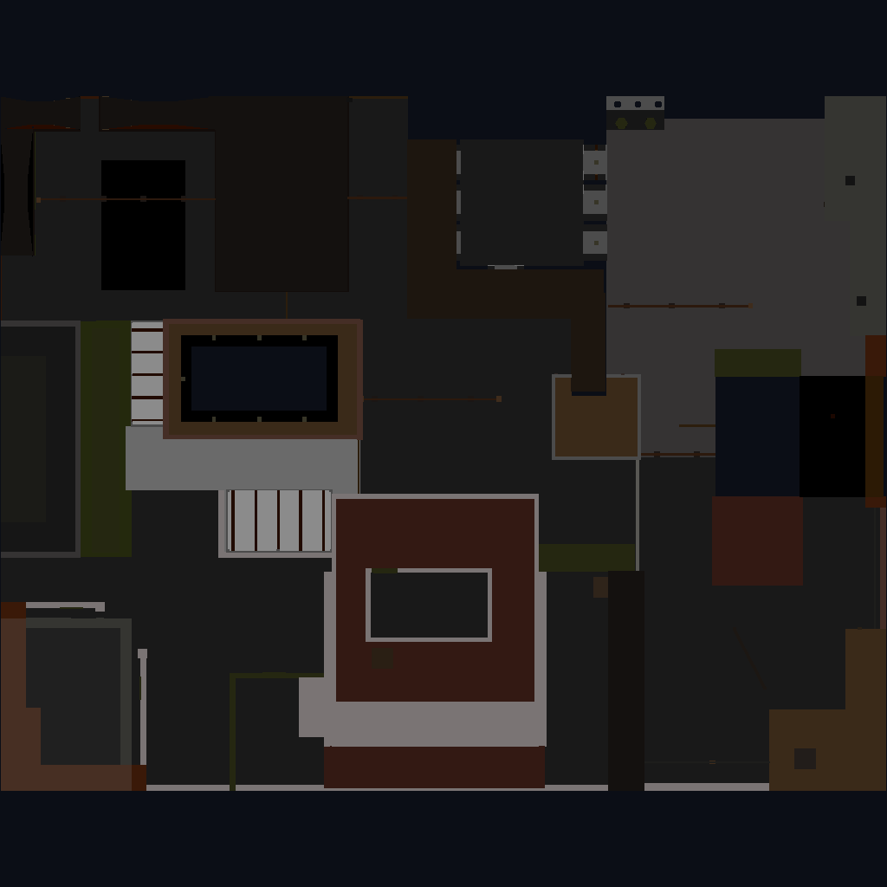
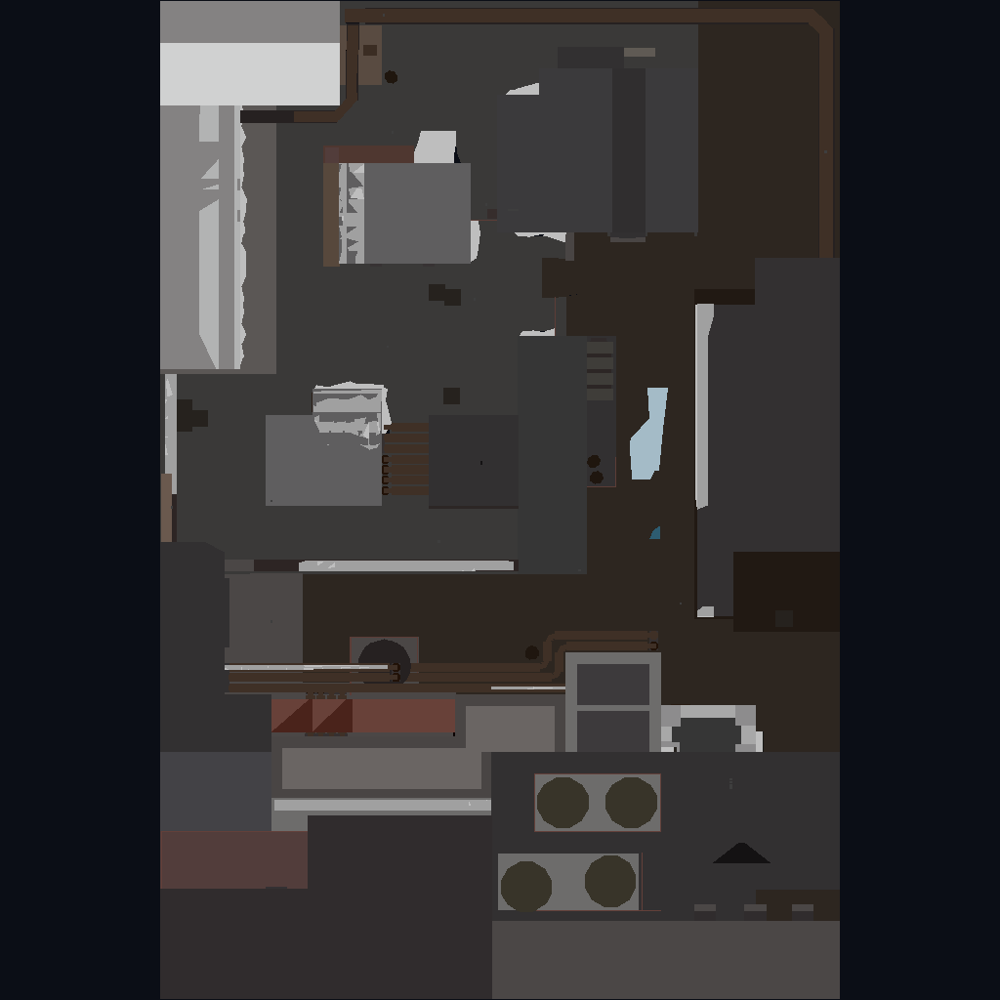
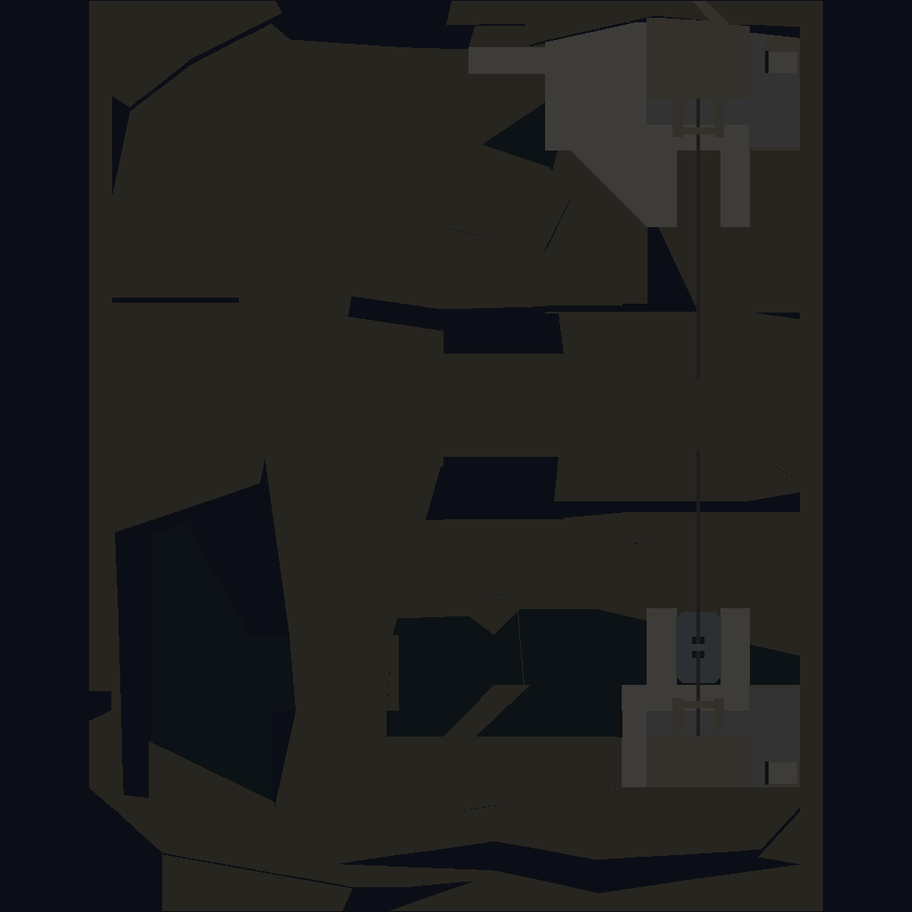

# AQ2 Replay Viewer

A local web application that parses **Action Quake 2** demo files (`.mvd2` / `.mvd2.gz`) and BSP map files to produce an interactive map replay viewer with per-match statistics.

Supports subdirectory scanning for large demo libraries.

---

## Features

- Interactive frame-by-frame replay with 60 fps smooth interpolation
- 3D replay viewer (Three.js, MD2 player/weapon models, BSP mesh)
- Live GTV stream viewer — connects to a running Q2Pro server in real time
- Top-view textured map overlay (rendered from BSP geometry)
- Per-player stats: kills, deaths, accuracy, damage, headshot kills, awards
- Team scores, round win tracking, team-kill detection
- Kill feed, match highlights, weapon usage and hit location charts
- Folder browser with search and pagination — handles 10k+ demo files
- Transparent `.mvd2.gz` decompression (truncated archives yield partial data)

## Map Previews

| icity | wfall | cloud |
|:---:|:---:|:---:|
|  |  |  |

| plaza | oyea | cliff2 |
|:---:|:---:|:---:|
|  |  |  |

---

## Quick Start

### Docker Compose

```bash
docker compose up --build
```

Open **http://localhost:5000** in your browser.

Demo files in `mvd2/` and map assets in `bsp/` are bind-mounted — no rebuild needed when adding new files.

### Local Docker Performance Notes (Windows/macOS)

If pages feel slow in Docker Desktop, the biggest bottleneck is usually SQLite on a host bind mount.

Use the local compose profile (`docker-compose.local.yml`) which stores:

- SQLite DB on Docker named volume (`/var/lib/aq2replay`)
- generated cache on Docker named volume (`/app/cache`)

That avoids slow cross-VM filesystem I/O from host-mounted folders and usually gives a large speed-up for stats pages.

Prewarm controls (environment variables):

- `STATS_PREWARM_SCOPE=off|standard|extended|full`
- `STATS_PREWARM_TOP_WEAPONS=<n>`
- `STATS_PREWARM_TOP_PLAYERS=<n>`
- `STATS_PREWARM_TOP_MAPS=<n>`
- `STATS_PREWARM_TOP_H2H=<n>`
- `STATS_PREWARM_INCLUDE_GEMINI=true|false`

Notes:

- `extended` is a good local default.
- `full` warms the broadest finite set (more CPU/IO at startup, faster first page opens later).
- Gemini prewarm is disabled by default to avoid API cost during warm-up.

### Production (Docker + Nginx Proxy Manager)

Production compose now runs Gunicorn (WSGI) inside the container instead of the Flask development server.
Gunicorn is started with `--chdir /app/web` and loads `app:app` so existing
imports (`parsers.*`, `db`) resolve correctly.

Deploy or update:

```bash
docker compose pull
docker compose build --no-cache
docker compose up -d
```

Oracle ARM VPS note (4 vCPU / 24 GB RAM):

- Keep `GUNICORN_WORKERS=1` (single in-process indexer/writer model).
- Use `GUNICORN_THREADS=6..8`.
- Use `STATS_PREWARM_SCOPE=extended` for a good startup/runtime balance.
- Tune SQLite with:
	- `STATS_SQLITE_READ_CACHE_KB`
	- `STATS_SQLITE_WRITE_CACHE_KB`
	- `STATS_SQLITE_MMAP_MB`
	- `STATS_SQLITE_TEMP_STORE`

The base image `python:3.12-slim` is multi-arch and works on ARM64.

Nginx Proxy Manager upstream target:

- Hostname/IP: container host where Docker runs
- Forward port: 5000
- Scheme: http

Recommended notes:

- Keep `FLASK_DEBUG=false` in production.
- Keep `GUNICORN_WORKERS=1` for this app because indexing runs in-process and should have a single writer process.
- Tune request concurrency with `GUNICORN_THREADS`.
- Container liveness is exposed at `/healthz` and used by Docker `HEALTHCHECK`.
- Manual reindex endpoint is disabled by default in production (`STATS_REINDEX_API_ENABLED=false`).
- Indexing still runs automatically: once on startup and then daily via watchdog.
- For emergency manual reindex in production, enable the endpoint and set `STATS_REINDEX_API_TOKEN`, then call the API with header `X-Reindex-Token: <token>`.

Security hardening now included by default in production compose:

- `PROXY_FIX_ENABLED=true`, `PROXY_FIX_X_FOR=1` (correct client IP/scheme behind reverse proxy)
- `ENABLE_HSTS=true` (adds `Strict-Transport-Security` response header)
- `API_RATE_LIMIT_ENABLED=true`, `API_RATE_LIMIT_PER_MIN=240` (simple per-IP API rate limiting)
- Optional API bearer auth is available (`API_BEARER_AUTH_ENABLED`, `API_BEARER_TOKEN`, `API_BEARER_HEADER`, `API_BEARER_SCOPE`).

Recommended bearer setup for public sites:

1. Set `API_BEARER_AUTH_ENABLED=true`.
2. Set `API_BEARER_SCOPE=admin` (protect only sensitive endpoints like reindex).
3. Set `API_BEARER_TOKEN` to a long random secret.
4. Configure Nginx Proxy Manager to add request header `X-Api-Bearer: <same-secret>` to upstream requests.

If you explicitly want a token on every `/api/*` request:

1. Set `API_BEARER_SCOPE=all`.
2. Ensure proxy header injection is applied to all API paths, otherwise browser features can fail with `401`.

For direct API clients (without proxy header injection), you can also send:

```bash
Authorization: Bearer <same-secret>
```

Important: browser API calls can never be fully hidden for a public web app. If data must be private,
protect the whole site with authentication at the reverse proxy (Nginx Proxy Manager Access List) or app login.

Check health status:

```bash
docker ps
docker inspect --format='{{.State.Health.Status}}' aq2replay
```

### Local (Python venv)

```bash
python -m venv venv
pip install -r requirements.txt
python web/app.py
```

### Live GTV Viewer

Connect to a running Q2Pro server's GTV port for a live 2D/3D map view with real-time player positions, kill feed, and stats.

Open `/live` in your browser, enter the server host, GTV port (27900–27970), and password.

**Anti-cheat delay** — the stream is delayed before it reaches the browser to prevent spectators from gaining a real-time advantage. Default is 60 seconds, configurable:

```bash
LIVE_STREAM_DELAY_SEC=60   # set to 0 to disable
LIVE_PRESET_PASSWORD=...   # GTV password for the preset server buttons
```

---

### Optional Gemini Analytics

By default, analytics insights are deterministic and generated from indexed stats.
You can optionally let Gemini write the narrative text for:

- `/api/stats/insights`
- `/api/replay/<file>/insights`

Environment variables:

```bash
AI_INSIGHTS_PROVIDER=gemini
GEMINI_MODEL=gemini-3.1-flash-lite-preview
GEMINI_TIMEOUT_SECONDS=12
GEMINI_API_KEY=your_google_ai_studio_key
```

Notes:

- Never commit real API keys to Git.
- If Gemini is unavailable (missing key, timeout, quota, HTTP error), the app automatically falls back to heuristic insights.
- Responses include `generator` (`heuristic` or `gemini`) and `model` (when Gemini is used).

---

## Folder Structure

```
mvd2/          ← place .mvd2 or .mvd2.gz demo files here (subdirs supported)
bsp/           ← place .bsp map files here
textures/      ← WAD/PAK textures for topview rendering (optional)
colormap.pcx   ← Quake 2 palette
players/       ← MD2 player models + team skins (players/male/tris.md2, ctf_r.png, ctf_b.png)
models/        ← weapon MD2 models + skins (models/weapons/…)
cache/         ← auto-generated SVG overviews, MD2 JSON, BSP mesh (created at runtime)
web/           ← Flask application
```

## Stack

Python 3 / Flask · Pillow · Vanilla JS · CSS custom properties (dark theme)
